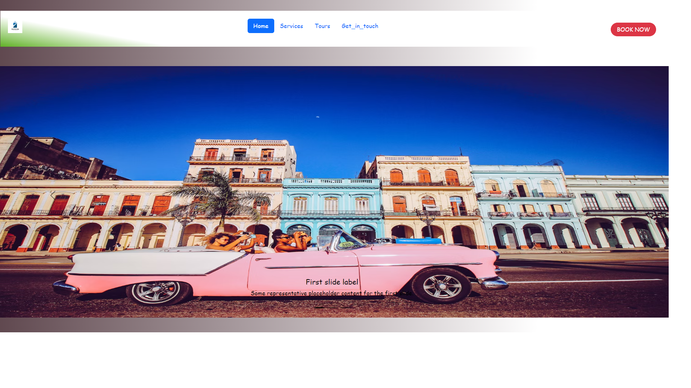
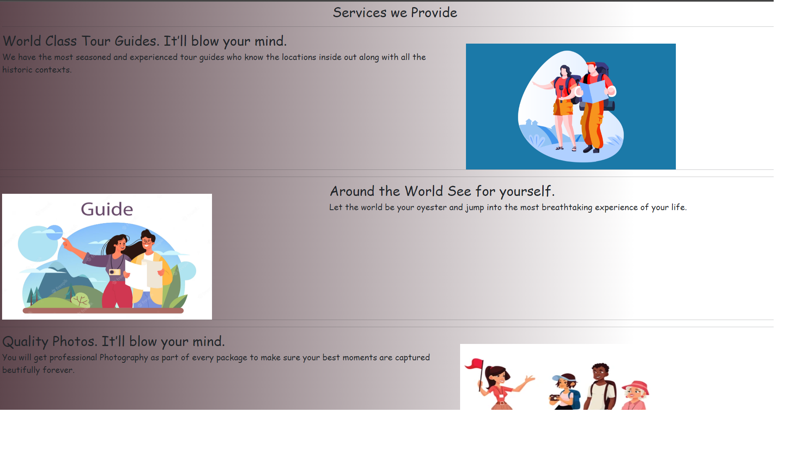

# Tourist_Guide
A simple Tourism Website Portfolio which shows travel destinations across various part of Country. And provide  guide This theme is made using Bootstrap ,Html , css features several content sections, a responsive portfolio grid (tourist-places), window modals for each portfolio item, Blogs section and AboutUs Section

Task:==>
Built this app to show Attractions and History of my Country "INDIA" and to polish my HTML5, CSS3,  and Web App Development Skills.

Tech Stack:==>
HTML5
CSS3
Font Awesome
VS Code
Bootstrap

Services

Tours 

Contact Us

After downloading, simply edit the HTML and CSS files included with the template in a code editor to make changes. These are the only files you need to worry about, you can ignore everything else! To preview the changes you make to the code, you can open the index.html file in your web browser.
